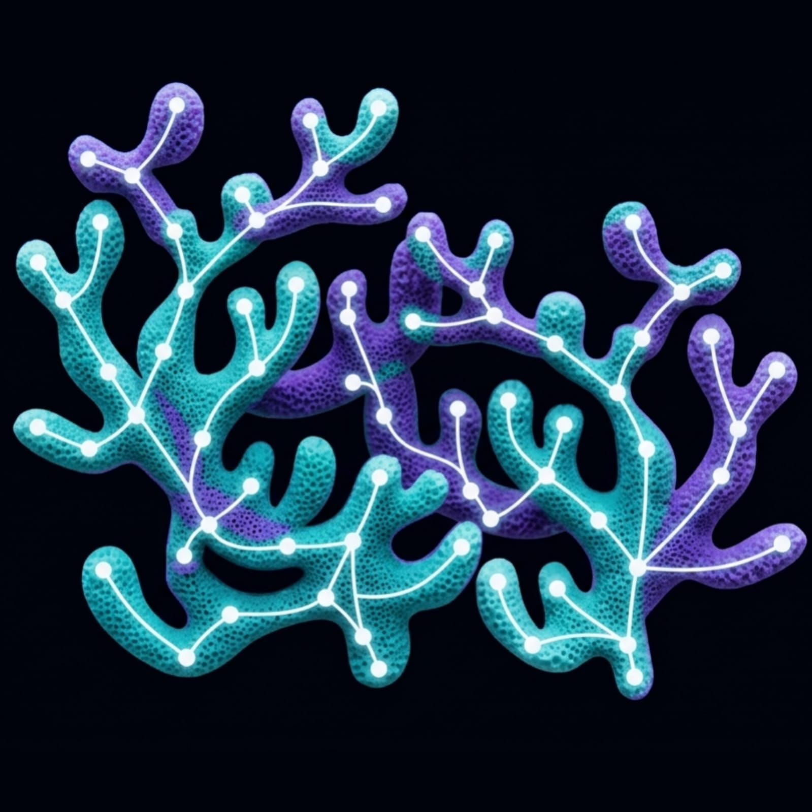

# 🪸 Coral Neural Networks

An AI-powered mobile application designed to diagnose coral health from photographs using Deep Learning (EfficientNet-B0) and visual explainability (Grad-CAM heatmaps).



## 📥 Download the App (APK)

**[Download the latest Android APK from the Releases Page](https://github.com/ushnizhx/coral-neural-networks/releases)**

> **Note:** The app requires the Python backend to be running (either locally or on a server) to process the images and generate the Grad-CAM heatmaps.

## 📌 Overview

This project consists of two main components:
1. **Backend (`backend/`)**: A Python FastAPI server that hosts a custom-trained EfficientNet-B0 PyTorch model. It processes images, predicts coral health (Healthy, Bleached, Dead), and generates Grad-CAM heatmaps to visually explain the AI's decision.
2. **Frontend (`coral_app/`)**: A sleek, production-ready Android application built with Flutter. It features a custom "Aquatic Lens" design system, image uploading, dynamic AI inference explanations, and probability spectrums.

## 🚀 Features

- **End-to-End Image Analysis**: Upload a coral image from your phone and get a real-time diagnosis.
- **Visual Explainability**: See exactly *why* the AI made its decision through generated Heatmap and Grad-CAM layers.
- **Dynamic AI Insights**: Human-readable text explanations that adapt based on the coral's predicted state.
- **Wireless Demo Mode**: Out-of-the-box support for Ngrok, allowing the mobile app to communicate wirelessly with a laptop backend.

## 🛠️ Tech Stack

- **Mobile App**: Flutter, Dart
- **Backend API**: Python, FastAPI, Uvicorn
- **Machine Learning**: PyTorch, TorchVision, OpenCV
- **Architecture**: REST API over Ngrok tunneling

## 💻 How to Run Locally

### 1. Start the Backend (Brain)
```bash
cd backend
pip install -r requirements.txt
uvicorn app:app --host 0.0.0.0 --port 8000
```

### 2. Expose the Server (Ngrok)
In a new terminal window:
```bash
ngrok http 8000
```
*Copy the `Forwarding https://...` URL provided by Ngrok.*

### 3. Run the Mobile App (Eyes)
1. Open `coral_app/lib/services/model_service.dart`.
2. Update the `_ngrokUrl` variable with your copied Ngrok URL.
3. Ensure `_useNgrok = true`.
4. Connect your Android device and run:
```bash
cd coral_app
flutter run
```

## 📄 Documentation
For an in-depth breakdown of the API schema, UI/UX Design System, and App Flow, please refer to the `Project_Documentation.md` file located in the root directory.
